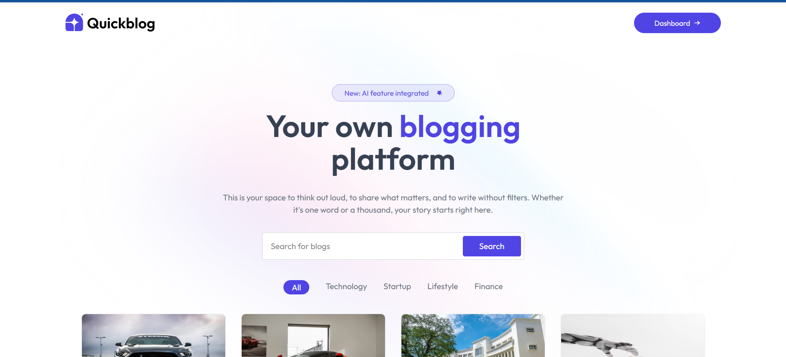

#  QuickBlog

**QuickBlog** is an AI-powered blogging application that makes it easy to create, manage, and publish blog posts. 🌟 With an intuitive React + Vite frontend, a Node/Express backend, and MongoDB for storage, QuickBlog also integrates ImageKit for seamless image uploads and an AI model (Gemini) for content assistance. 🖼️🤖

[](https://github.com/Krishna200608/QuickBlog/commits/main)
[](https://github.com/Krishna200608/QuickBlog)
[](LICENSE)

---

## 🚀 Live Demo

* **Frontend:** [https://quick-blog-frontend-nu.vercel.app/](https://quick-blog-frontend-nu.vercel.app/)

---

## 🎨 Preview




---

## 📂 Project Structure

```
quickblog/
├── backend/
│   ├── src/
│   ├── .env
│   ├── package.json
│   └── ...
└── frontend/
    ├── src/
    ├── .env
    ├── package.json
    └── ...
```

---

## 🔧 Tech Stack & Tools


---

## ✨ Key Features

* ✅ **Create, Edit, Delete Posts** — simple, intuitive CRUD for blog posts.
* ✅ **Image Uploads** — upload images via ImageKit and attach them to posts.
* ✅ **AI Assistance (Gemini)** — generate ideas, titles, or draft content automatically (optional — requires API key).
* ✅ **Authentication** — admin sign-in using credentials defined in `.env`.
* ✅ **Responsive UI** — works well on mobile and desktop.
* ✅ **Admin Controls** — manage posts and moderate content from the admin area.
* ✅ **Easy Deployment** — optimized for Vercel (frontend) and typical Node hosts (backend).

---

## 📝 Prerequisites

* Node.js v14+
* npm or yarn
* MongoDB (local or Atlas)
* ImageKit account (for image uploads)
* Gemini API key (if you want AI features)

---

## ⚙️ Configuration

Create `.env` files for backend and frontend (you can copy from `.env.example` if present).

### Backend — `backend/.env`

```dotenv
PORT=4000
MONGODB_URI="Your_MongoDB_Url"

# Admin Credentials
ADMIN_EMAIL='your-admin@example.com'
ADMIN_PASSWORD='yourAdminPassword'

# JWT Secret
JWT_SECRET='yourJwtSecret'

# ImageKit
IMAGEKIT_PUBLIC_KEY='yourImageKitPublicKey'
IMAGEKIT_PRIVATE_KEY='yourImageKitPrivateKey'
IMAGEKIT_URL_ENDPOINT='https://ik.imagekit.io/your_url_endpoint'

# Gemini (Optional)
GEMINI_API_KEY='yourGeminiApiKey'
```

### Frontend — `frontend/.env`

```dotenv
VITE_BACKEND_URL="http://localhost:4000"    # or your deployed backend URL
```

> **Security tip:** Never commit `.env` files. Add them to `.gitignore`.

---

## 📦 Installation & Running Locally

### 1. Clone the repository

```bash
git clone https://github.com/Krishna200608/QuickBlog.git
cd QuickBlog
```

### 2. Backend

```bash
cd backend
npm install
# update .env
npm run server       # or `npm run dev` if configured with nodemon
# default: http://localhost:4000
```

### 3. Frontend

Open a new terminal:

```bash
cd frontend
npm install
# update .env
npm start             # or `npm run dev` depending on scripts
# default: http://localhost:5173
```

Now open the frontend URL in your browser. The frontend will communicate with the backend via `VITE_BACKEND_URL`.

---

## 🔁 Deployment

* **Frontend:** Deploy the `frontend` folder to Vercel (or Netlify). Set `VITE_BACKEND_URL` in Vercel settings.
* **Backend:** Deploy to Vercel Serverless, Render, Railway, Heroku, or any Node host. Add all `.env` variables to the host's environment settings.
* **ImageKit & Gemini:** Add keys to production environment variables.

---

## 🛠️ Development Tips

* Use Postman / Insomnia for testing backend endpoints.
* Seed an admin using the `ADMIN_EMAIL` and `ADMIN_PASSWORD` set in `.env`.
* If enabling Gemini features, confirm rate limits and key permissions before heavy usage.

---

## Contributing

Contributions are welcome! Please:

1. Fork the repo
2. Create a branch: `git checkout -b feature/your-feature`
3. Commit: `git commit -m "Add: brief description"`
4. Push: `git push origin feature/your-feature`
5. Open a Pull Request

Please follow project coding style and add tests / documentation for major features.

---

## License

This project is licensed under the **IIITA License** — see the `LICENSE` file for details.

---

## Contact

**Krishna Sikheriya** — [krishnasikheriya001@gmail.com](mailto:krishnasikheriya001@gmail.com)
GitHub: [github.com/Krishna200608](https://github.com/Krishna200608)

---

*Happy blogging with QuickBlog!* ✍️🚀
